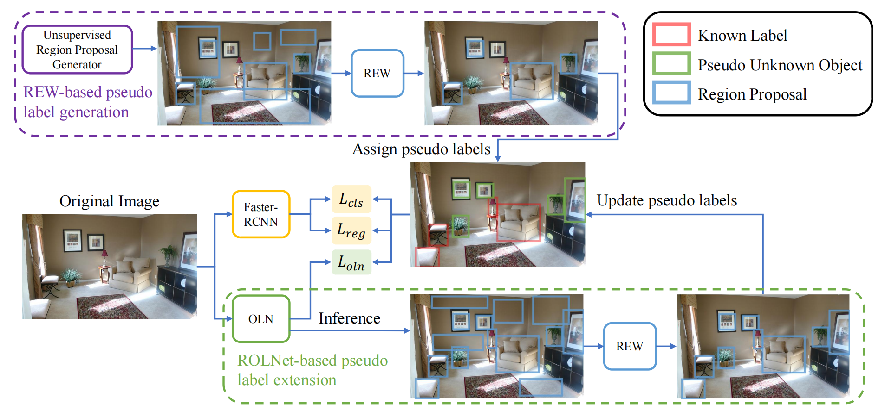
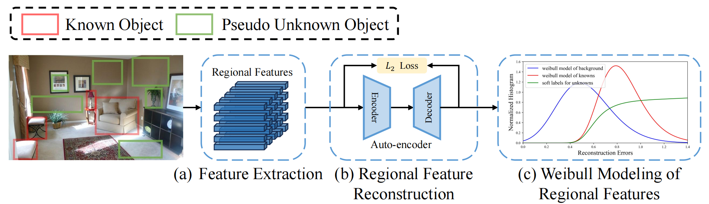

# MEPU-OWOD
Code Implementation of "Unsupervised Recognition of Unknown Objects for Open-World Object Detection"
*([arXiv 2308.16527](http://arxiv.org/abs/2308.16527))*  
# Introduction
<p align="center">  </p>

### Our Key Technique: Reconstruction Error-based Weibull modeling (REW)
<p align="center">  </p>

# Dataset Preparation 

Please first download the MS COCO dataset and the directory structure should be like:
```
mepu-owod/
└── datasets/
    └── coco/
        ├── annotations/
        ├── train2017/
        └── val2017/
```
Prepare dataset for S-OWOD:
```
sh prepare_dataset.sh
```
The training dataset for S-OWODB and M-OWODB should be like:

```
mepu-owod/
└── datasets/
    └── mowod/
        ├── Annotations/
        ├── ImageSets/
        └── JPEGImages/
    └── sowod/
        ├── Annotations/
        ├── ImageSets/
        └── JPEGImages/
```

# Training and Testing

Unsupervised pretraining of REW:
```
sh train_rew.sh
```
Train MEPU on the S-OWOD benchmark:
```
sh script/train_mepu_fs.sh
```
Evaluate MEPU on the S-OWOD benchmark:
```
sh script/eval_owod.sh
```

# Results

<table align="center">
    <tr>
        <th> </th>
        <th align="center" colspan=2>Task1</th>
        <th align="center" colspan=2>Task2</th>
        <th align="center" colspan=2>Task3</th>
        <th align="center" colspan=1>Task4</th>
    </tr>
    <tr>
        <td align="left">Method</td>
        <td align="center">U-Recall</td>
        <td align="center">mAP</td>
        <td align="center">U-Recall</td>
        <td align="center">mAP</td>
        <td align="center">U-Recall</td>
        <td align="center">mAP</td>
        <td align="center">mAP</td>
    </tr>
    <tr>
        <td align="left">ORE-EBUI</td>
        <td align="center">1.5</td>
        <td align="center">61.4</td>
        <td align="center">3.9</td>
        <td align="center">40.6</td>
        <td align="center">3.6</td>
        <td align="center">33.7</td>
        <td align="center">31.8</td>
    </tr>
    <tr>
        <td align="left">OW-DETR</td>
        <td align="center">5.7</td>
        <td align="center">71.5</td>
        <td align="center">6.2</td>
        <td align="center">43.8</td>
        <td align="center">6.9</td>
        <td align="center">38.5</td>
        <td align="center">33.1</td>
    </tr>
    <tr>
        <td align="left">PROB</td> 
        <td align="center">17.6</td>
        <td align="center">73.5</td>
        <td align="center"> 22.3</td>
        <td align="center">50.4</td>
        <td align="center"> 24.8</td>
        <td align="center">42.0</td>
        <td align="center"> 39.9</td>
    </tr>
    <tr>
        <td align="left">CAT</td>
        <td align="center">24.0</td>
        <td align="center">74.2</td>
        <td align="center">23.0</td>
        <td align="center">50.7</td>
        <td align="center">24.6</td>
        <td align="center">45.0</td>
        <td align="center">42.8</td>
    </tr>
    <tr>
        <td align="left">MEPU-FS (Ours)</td>
        <td align="center">37.9</td>
        <td align="center">74.3</td>
        <td align="center">35.8</td>
        <td align="center"> 54.3</td>
        <td align="center">35.7</td>
        <td align="center">46.2</td>
        <td align="center">41.2</td>
    </tr>
    <tr>
        <td align="left">MEPU-SS (Ours)</td>
        <td align="center">33.3</td>
        <td align="center"> 74.2</td>
        <td align="center"> 34.2</td>
        <td align="center">53.6</td>
        <td align="center"> 33.6</td>
        <td align="center">45.8</td>
        <td align="center"> 40.8</td>
    </tr>
</table>
